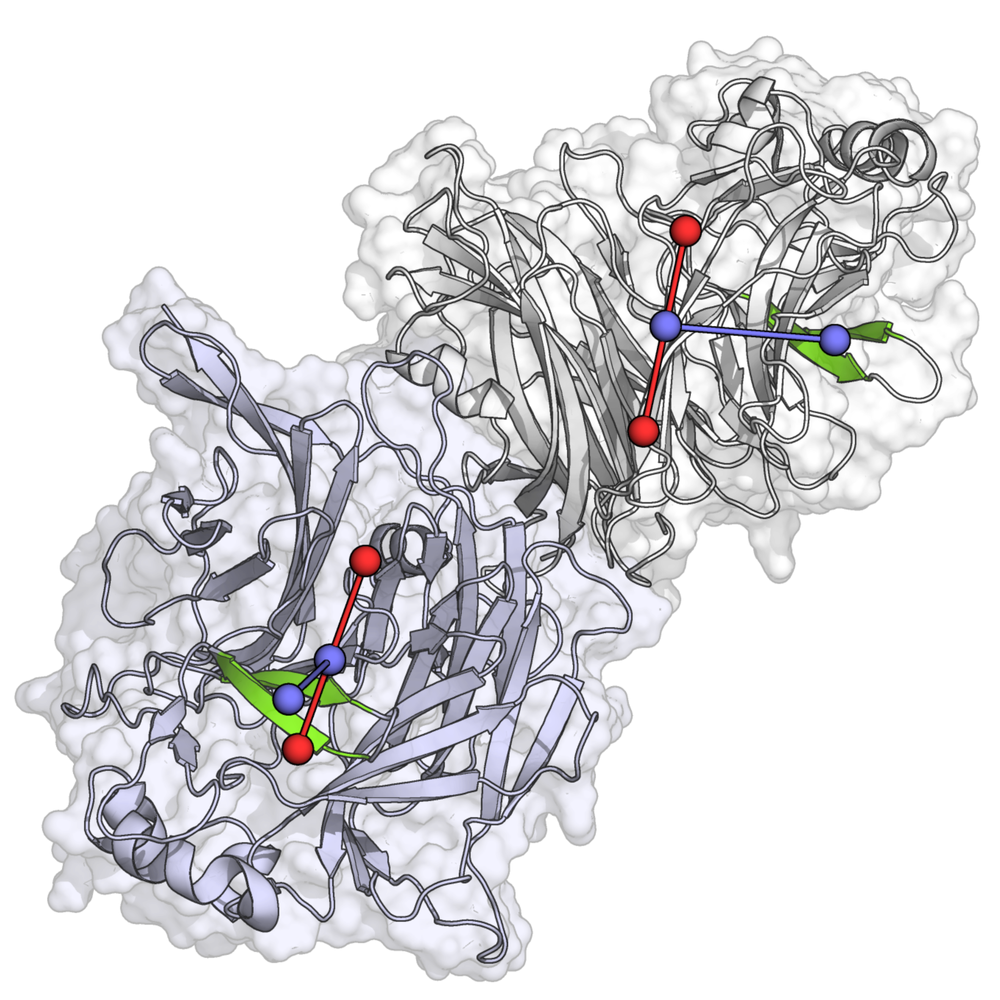
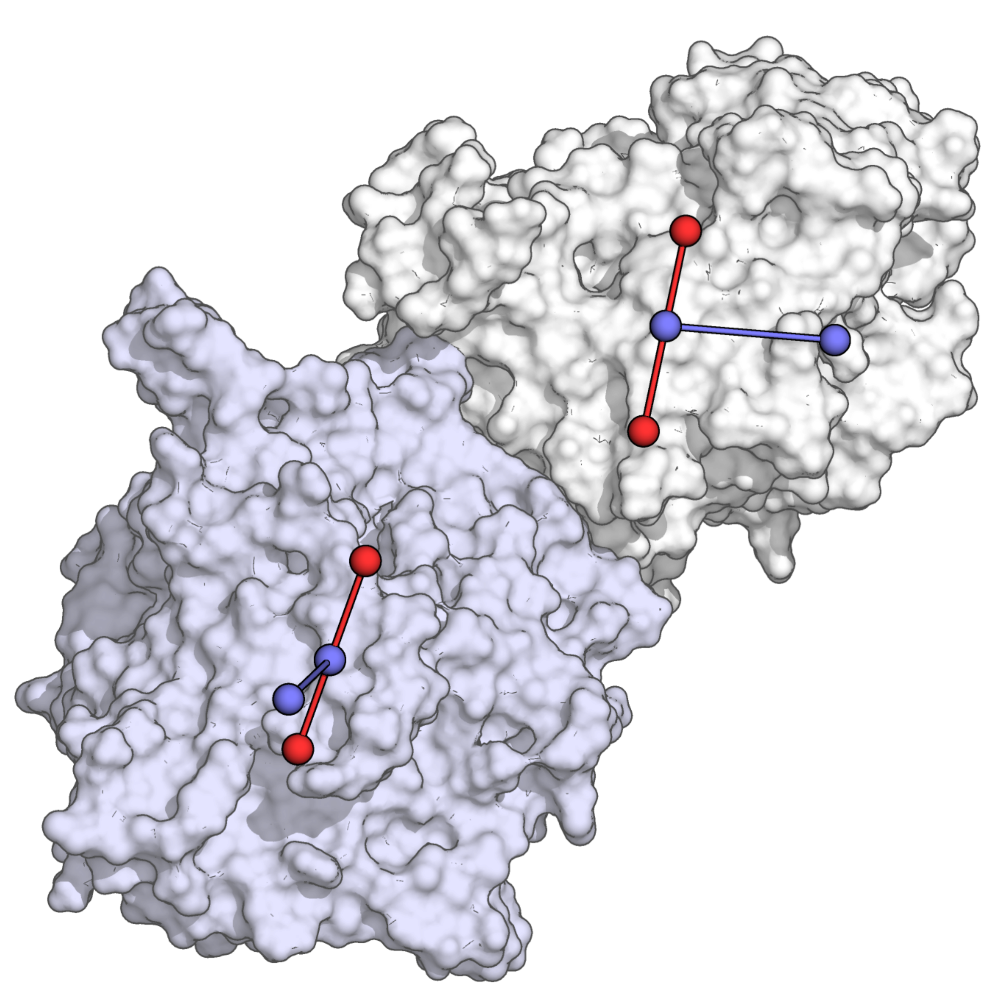

# Colvar

Useful application of rotations with quaternions by rotating and translating PDB
files. The `quaternion.py` has a quaternion class that defines quaternion operations
with some other useful functions. Most importantly for rotations the product of two
quaternions given $\textbf{q} = (r, \vec{v})$ where $q \in \mathbf{H}$, $r \in \mathbf{R}$
and $\vec{v} \in \mathbf{R}^3$ then

$$(r_1, \vec{v}_1)(r_2, \vec{v}_2) = (r_1r_2 - \vec{v}_1\cdot\vec{v}_2, r_1\vec{v}_2+r_2\vec{v}_1+\vec{v}_1\times\vec{v}_2)$$

Quaternions can be stacked to perform multiple rotations for example given $\vec{u} \in \mathbf{R}^3$ 
and $\theta_{1}$
the angle needed to rotate $\vec{u}$
to lie in the XY plane and $\theta_{2}$
the angle needed to then rotate it unto the x-axis with quaternions one can simply do $(q_{\theta_2}q_{\theta_1})q(q_{\theta_2}q_{\theta_1})^{-1}$
where $q_{\theta}$
is the normalized quaternion related to the appropriate rotation and $q$
is $\vec{u}$
extended into a quaternion.

## Example

$\vec{u} = (1, 1, 1)$
then $q = (0, \vec{u}) = (0,1,1,1) \in \mathbf{H}$.
We can write the quaternions in their angle axis notation for the rotations $(\cos(\theta/2), \text{axis}\times\sin(\theta/2))$.
To place the vector unto the x-axis we can first rotate along the x-axis to put the vector in the XY plane therefore $q_{\theta_1} = (\cos(\theta_1/2),\sin(\theta_1/2),0,0)$
once on the XY plane we can rotate along the z-axis then ${\theta_2} = (\cos(\theta_2/2), 0, 0,\sin(\theta_2/2))$
(notice that this rotations are along the usual axis but the definition is not limited one can rotate along any axis). All we are missing is to figure out the necessary angles
$\theta_1 = \arctan2(-\vec{u}_z, \vec{u}_y) = -45.0^\circ \longrightarrow q_{\theta_1} = (0.92, -0.38, 0, 0)$
$\theta_2 = \arctan2(-(\cos(\theta_1)\vec{u}_y-\sin(\theta_1)\vec{u}_z), \vec{u}_x) = \arctan2(1.4, 1) = -54.7^\circ \longrightarrow q_{\theta_2} = (0.89, 0, 0, -0.46)$

$$q_{\theta_2} q_{\theta_1}  = ((0.92)(0.89)-0,(-0.34,0,0)+(0,0,-0.42)+(0,0.18,0))= (0.82,-0.34,0.18,-0.42)$$

Since we have a normalized quaternion the inverse is just the conjugate

$$(q_{\theta_2} q_{\theta_1})^{-1}  = (0.82,0.34,-0.18,0.42)$$

Finally all that takes to do all rotations is

$$(0.82,-0.34,0.18,-0.42)(0,1,1,1)(0.82,0.34,-0.18,0.42) = (0,1.73,0,0) \longrightarrow \vec{w} = (\sqrt3,0,0)$$

We get the result as expected the benefit of quaternions is that the rotations can be stacked and also it is very easy to rotate along and arbitrary axis.

## Application

Using the `read_geo.py` that has very basic utilities to read and write different type of atomic coordinate files one can read a pdb, define a particular vector and then rotate all coordinates such that the chosen vector lies on the z-axis. The `colvar.py` presents a way on how to do this.

```
python colvar.py -c1 ./data/mv_sia.pdb -c2 ./data/apo_tpr.pdb -s ./data/apo.tpr -f ./data/fit.xtc
```

<p align="center">
  
  
</p>

This will also generate a `vis.py` that can be run using pymol.

## Extra

The `com_traj.py` writes the GROMACS output for the CoM of different selections into a pdb file to visualize as a trajectory.

<p align="center">
  
</p>